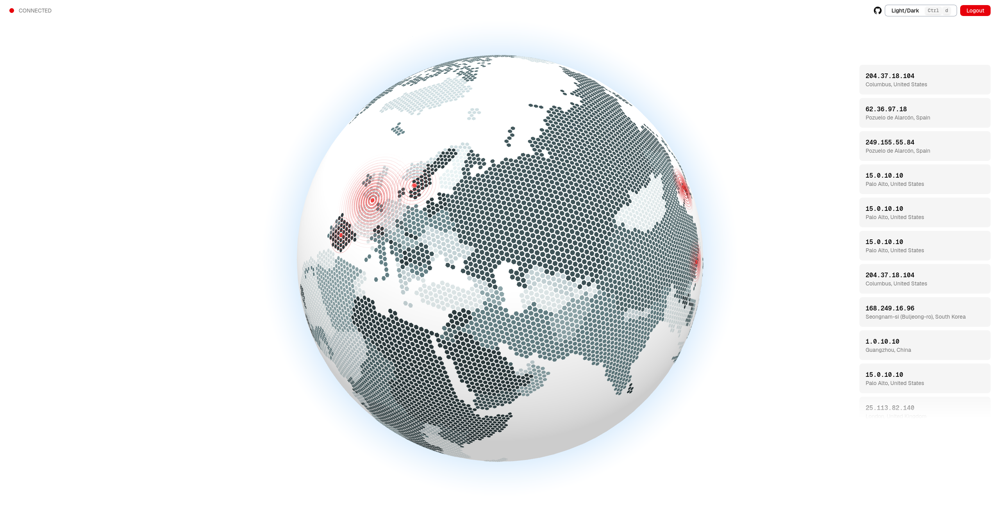

# XDProbe

> *Who the hell hits my server?*

XDP-based ingress network traffic monitor. Attaches an eBPF/XDP program to a network interface, enriches captured source IPs with GeoIP data, and streams them live to a web UI via SSE — including a 3D globe visualization.



## Get Started

Download the latest binary,

```sh
curl -L https://github.com/asiffer/xdprobe/releases/latest/download/xdprobe -o xdprobe
chmod +x xdprobe
```

then get a GeoIP database,

```sh
curl -L https://download.db-ip.com/free/dbip-city-lite-2026-04.mmdb.gz | gzip -d > geoip.mmdb
```

and run the binary (as `root` or with `CAP_NET_ADMIN` capability).

```sh
sudo ./xdprobe --interface eth0 --geoip geoip.mmdb
```

The web UI is available at [`http://localhost:8080`](http://localhost:8080) (login: `admin` / `password`).


## Configuration

All flags can also be set via environment variables prefixed with `XDPROBE_`.

| Flag                | Env                | Default      | Description                    |
| ------------------- | ------------------ | ------------ | ------------------------------ |
| `-i`, `--interface` | `XDPROBE_NIC`      | `lo`         | Network interface to attach to |
| `-a`, `--addr`      | `XDPROBE_ADDR`     | `:8080`      | HTTP server listen address     |
| `-g`, `--geoip`     | `XDPROBE_GEOIP`    | *(required)* | GeoIP database file (mmdb)     |
| `-t`, `--tick`      | `XDPROBE_TICK`     | `1s`         | eBPF map polling interval      |
| `-u`, `--username`  | `XDPROBE_USERNAME` | `admin`      | Web UI username                |
| `-p`, `--password`  | `XDPROBE_PASSWORD` | `password`   | Web UI password                |
| `-k`, `--insecure`  | `XDPROBE_INSECURE` | `false`      | Disable authentication         |

## Service

You can run an all-in-one installation script that will download everything and install a systemd service.

```sh
curl -sL https://raw.githubusercontent.com/asiffer/xdprobe/master/systemd/install.sh | sh
```

## Build from Source

You need to install few system dependencies notably to compile the XDP hook.
```sh
sudo apt-get update
sudo apt-get install -y clang llvm libbpf-dev linux-tools-common linux-headers-$(uname -r) gcc-multilib
```

Then you can clone the repo, install tailwind through `bun` (or any other package manager) and run the the build process.

```sh
git clone https://github.com/asiffer/xdprobe.git
cd xdprobe
bun install
make
```

The resulting `xdprobe` binary embeds everything beyond a GeoIP database.


## Stack

- **eBPF/XDP** — kernel-space packet capture via [cilium/ebpf](https://github.com/cilium/ebpf)
- **Go** — HTTP server, SSE broker, GeoIP enrichment
- **Alpine.js** + **Tailwind CSS** — reactive web UI
- **globe.gl** + **H3** — 3D globe with hexagonal binning

